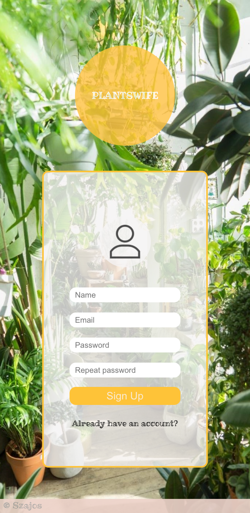
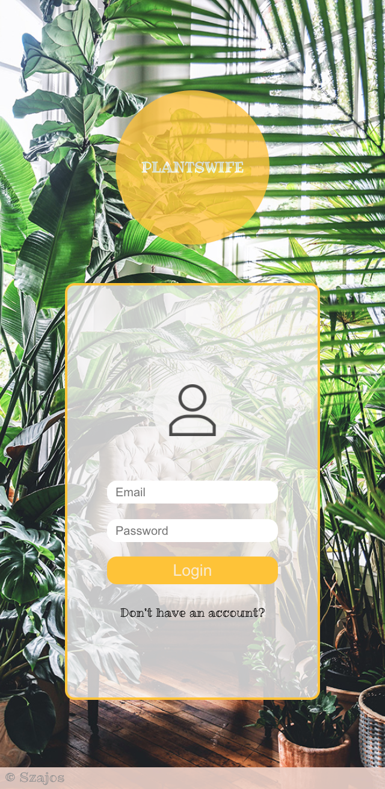
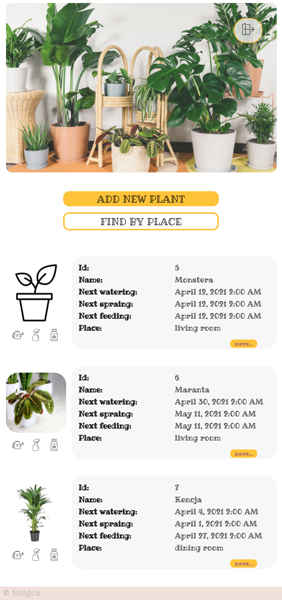
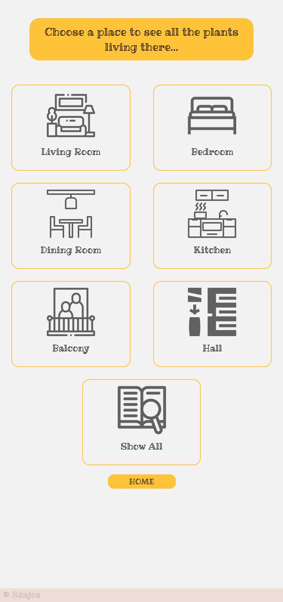
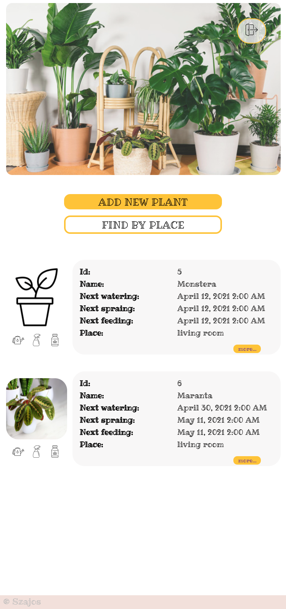
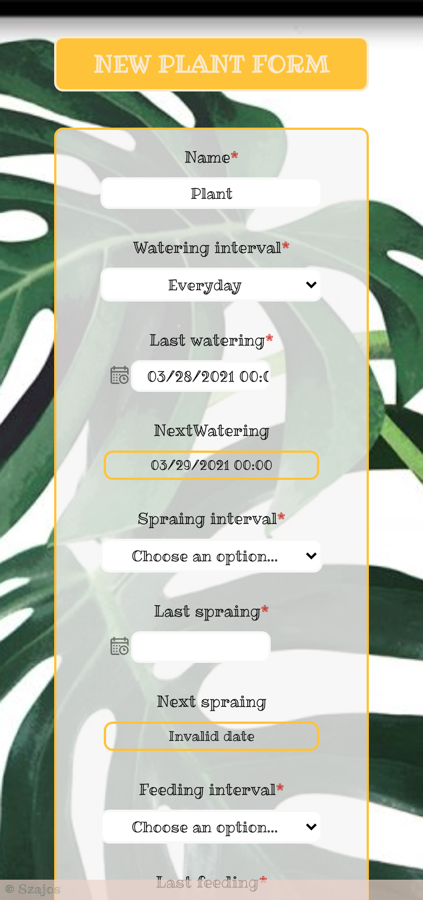
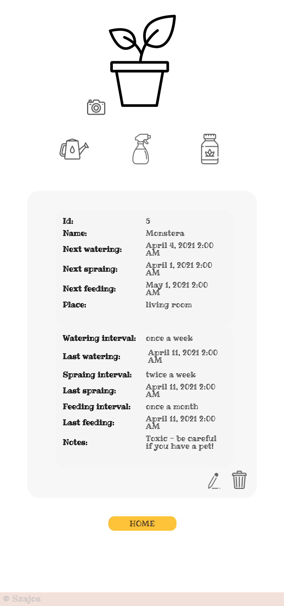
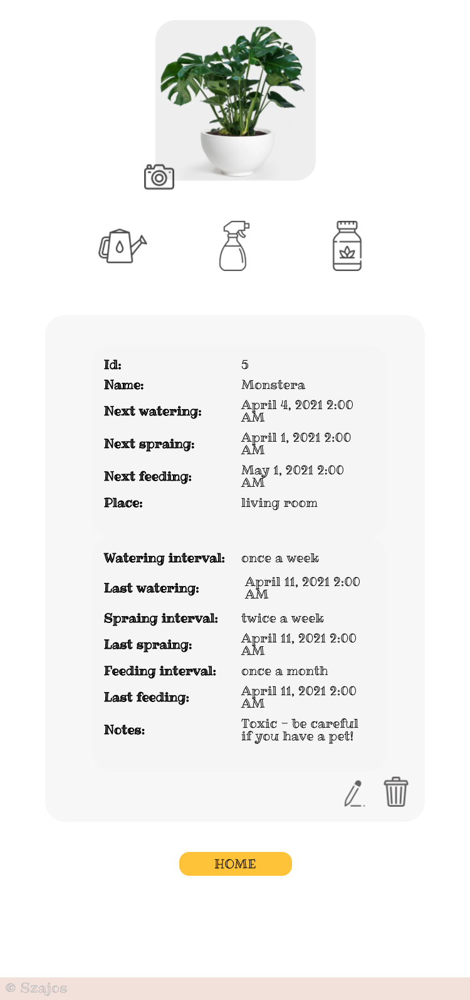
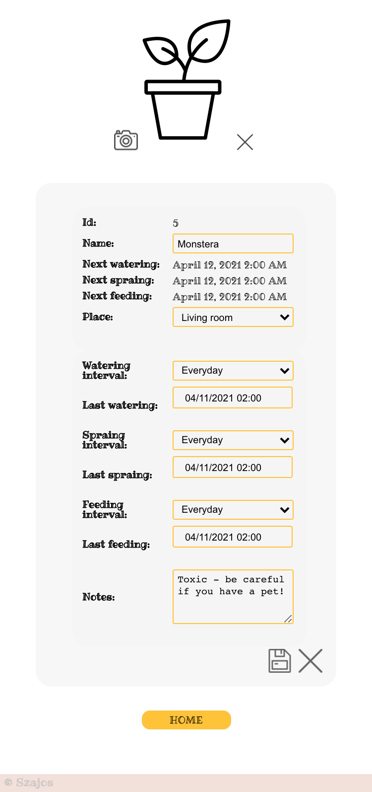
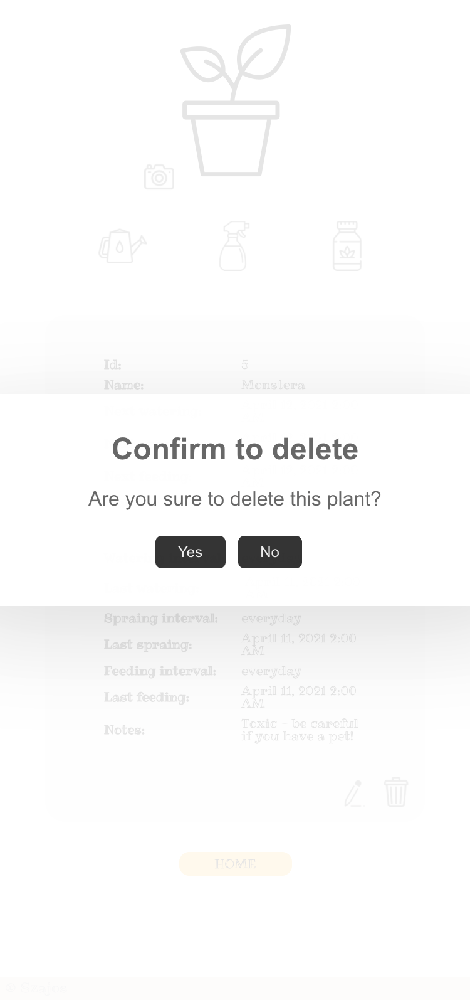

#**Plantswife**

## Table of contents
* [General info](#general-info)
* [Technologies](#technologies)
* [Demo](#demo)
* [Features](#Features)
* [Screenshots](#Screenshots)

## General info
**Plantswife** is a mobile app for managing a houseplant jungle. Allows to keep all your plants data in one place, easily add, edit or delete elements. Simply buttons allows for quick next watering, spraing or feeding tasks updates. You don't have to remember dates, app will do it for you. Adding plants' photos help to monitor their growth and find in you own plants' database. You can finally say goodbye to shed or withered plants. Enjoy beautiful home jungle and free your mind!

## Technologies
**Frontend:** React, JavaScript, SCSS 
**Backend:** Nest.js (https://github.com/kSzajo/plantswife-backend) 

##DEMO https://plantswife.herokuapp.com/
###Create new user or login with test credentials:
**LOGIN:** test@test.test 
**PASSWORD:** qwe123 

## Features
* Login/Register
* Create new plant
* Update plant data
* Update next watering/spraing/feeding dates by clicking the icon buttons
* Add and delete plant photo
* Delete plant
* Filter plants by its location

##SCREENSHOTS

**Be aware!** Due to the fact that Heroku app is going inactive after long time of non-use, plants photos might be reset after turning off the app.